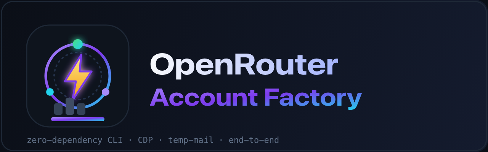
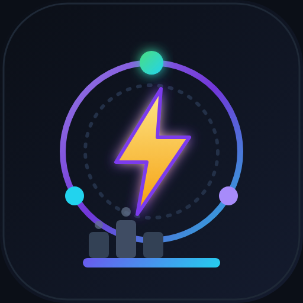

<div align="center">





# OpenRouter Account Factory

**Buat dan verifikasi akun OpenRouter secara end-to-end — pendaftaran, verifikasi email, onboarding, dan pembuatan API key — lewat satu perintah.**

[](#)
[](../LICENSE)
[](https://nodejs.org)
[](../package.json)
[](#kontribusi)
[](https://github.com/0xgetz/openrouter-account-factory/stargazers)
[](https://github.com/0xgetz/openrouter-account-factory/network/members)
[](https://github.com/0xgetz/openrouter-account-factory/issues)
[](https://github.com/0xgetz/openrouter-account-factory/commits/main)

[English](../README.md) · [Bahasa Indonesia](README.id.md) · [Español](README.es.md) · [中文](README.zh.md) · [日本語](README.ja.md)

</div>

---

## Ringkasan

`openrouter-account-factory` adalah CLI Node.js tanpa dependency yang mengotomatiskan pembuatan
akun OpenRouter sepenuhnya menggunakan alamat email sementara dari [Zenvex](https://zenvex.dev).
Script ini mengendalikan browser Chrome/Chromium nyata melalui **Chrome DevTools Protocol (CDP)**
dan menyelesaikan setiap langkah yang biasa dilakukan manusia:

1. **Daftar** — mengisi formulir pendaftaran OpenRouter.
2. **Verifikasi** — membaca tautan verifikasi dari inbox sementara dan membukanya.
3. **Onboarding** — menyelesaikan survei setelah pendaftaran.
4. **Provisioning** — membuat API key baru tanpa kedaluwarsa & tanpa limit, lalu menyalinnya.

Terverifikasi end-to-end: percobaan `--count 10` berhasil **10/10 akun**.

> [!IMPORTANT]
> Alat ini untuk **pengujian, QA, riset, dan tujuan edukasi yang sah saja**. Anda bertanggung jawab
> mematuhi Ketentuan Layanan OpenRouter dan hukum yang berlaku. Gunakan dengan risiko sendiri.

## Fitur

- ⚡ **Tanpa dependency** — memakai `WebSocket` bawaan (Node ≥ 20).
- 🌐 **Fleksibel** — endpoint CDP apa pun: Browser Use Cloud, Chrome Docker, Chrome lokal.
- 📧 **Verifikasi temp-mail** — polling inbox dan ekstraksi tautan otomatis.
- 🛡️ **Sadar anti-bot** — menunggu interstitial `protect-check` Cloudflare.
- 🔑 **Pembuatan key** — membuat `Main Key` bernama (tanpa kedaluwarsa, tanpa limit).
- 🧩 **Mudah di-script** — output JSONL rapi, `--count N`, nama/domain/password bisa diatur.
- 🔁 **Tangguh** — retry otomatis saat target CDP basi dan menutup tab berlebih.

## Kebutuhan

| Kebutuhan | Detail |
|---|---|
| **Node.js** | `>= 20` (memakai `WebSocket` bawaan; tanpa `npm install`) |
| **Browser** | Chrome/Chromium apa pun yang menyediakan endpoint WebSocket CDP |
| **OS** | Linux, macOS, atau Windows |

## Instalasi

```bash
git clone https://github.com/0xgetz/openrouter-account-factory.git
cd openrouter-account-factory
# tidak perlu npm install — tanpa dependency
```

## Penggunaan

Arahkan CLI ke endpoint CDP lalu jalankan:

```bash
BU_CDP_WS="wss://<browser-anda>/devtools/browser/<id>" \
  node src/index.mjs --count 10 --password 'PasswordAnda!1' --out ./openrouter_accounts.jsonl
```

### Opsi CLI

| Flag | Default | Keterangan |
|------|---------|------------|
| `--count N` | `1` | Jumlah akun yang dibuat |
| `--password P` | acak | Password untuk setiap akun |
| `--first NAME` | `Budi` | Nama depan saat daftar |
| `--last NAME` | `Santoso` | Nama belakang saat daftar |
| `--domain D` | `souss.dev` | Domain penerima Zenvex |
| `--out PATH` | `./openrouter_accounts.jsonl` | File hasil (satu objek JSON per baris) |
| `--cdp URL` | `$BU_CDP_WS` / `$BU_CDP_URL` | Endpoint WebSocket CDP |
| `--help`, `-h` | — | Tampilkan bantuan |
| `--version`, `-v` | — | Tampilkan versi |

### Menghubungkan browser

**Opsi A — Browser Use Cloud**

```bash
export BU_CDP_WS="wss://<sesi>.cdp.browser-use.com/devtools/browser/<id>"
node src/index.mjs --count 5
```

**Opsi B — Chrome lokal**

```bash
# Linux
google-chrome --remote-debugging-port=9222 --user-data-dir=./.chrome-profile
# lalu
node src/index.mjs --cdp "$(curl -s http://127.0.0.1:9222/json/version | jq -r .webSocketDebuggerUrl)" --count 1
```

## Output

Hasil ditambahkan ke file `--out` dalam format JSONL:

```json
{"email":"orm60kb1mg5r@souss.dev","key":"sk-or-v1-bf95...1c6f","ok":true,"created":"2026-09-29T04:11:08.371Z"}
```

Contoh halaman yang mudah dibaca tersedia di `docs/sample-output.html`.

## Cara kerja

1. Alamat acak dibuat di domain Zenvex `souss.dev` dan inbox-nya dibuka.
2. Formulir pendaftaran OpenRouter diisi dan dikirim.
3. Interstitial `protect-check` Cloudflare ditunggu.
4. Email verifikasi dibuka dan tautannya diikuti, sehingga akun langsung login.
5. Survei onboarding diselesaikan.
6. `Main Key` baru (tanpa kedaluwarsa, tanpa limit) dibuat lalu dibaca dari clipboard.

## Struktur proyek

```
openrouter-account-factory/
├── assets/
│   ├── logo.svg                # app icon / avatar
│   ├── logo.png
│   ├── banner.svg              # repo banner
│   └── banner.png
├── src/
│   └── index.mjs                 # seluruh CLI + klien CDP (tanpa dependency)
├── docs/
│   ├── README.id.md              # Bahasa Indonesia
│   ├── README.es.md              # Español
│   ├── README.zh.md              # 中文
│   ├── README.ja.md              # 日本語
│   ├── ARCHITECTURE.md
│   └── sample-output.html
├── .github/
│   └── ISSUE_TEMPLATE/
├── package.json
├── LICENSE
└── README.md
```

## Pemecahan masalah

| Gejala | Penyebab / solusi |
|---|---|
| `Temporary email services are not supported` | Domain diblokir. Gunakan `--domain souss.dev`. |
| Terjebak di `Verifying your request` | `protect-check` Cloudflare. Script menunggu ~2 menit; jaga browser tetap hidup. |
| `Session with given id not found` | Target CDP basi. Script attach ulang otomatis; jika tetap, restart browser. |
| `no verification link` | Preview inbox belum termuat. Script memilih baris lalu menekan Enter. |
| `zenvex address mismatch` | Zenvex menyimpan alamat sesi sebelumnya. Script mengirim ulang; pastikan hanya satu tab. |

## Kontribusi

Kontribusi sangat diterima! Silakan buka PR:

1. Fork repo ini
2. Buat branch (`git checkout -b fitur/fitur-keren`)
3. Commit perubahan (`git commit -m 'feat: menambah fitur keren'`)
4. Push dan buka Pull Request

## Lisensi

Didistribusikan di bawah **Lisensi MIT**. Lihat [`LICENSE`](../LICENSE).

## Penafian

Proyek ini disediakan untuk tujuan edukasi dan pengujian yang sah. Penulis tidak bertanggung jawab
atas penyalahgunaan atau pelanggaran ketentuan layanan pihak ketiga.

<div align="center">

Dibuat dengan ❤️ oleh [0xgetz](https://github.com/0xgetz)

⭐ **Beri bintang jika bermanfaat!**

</div>
