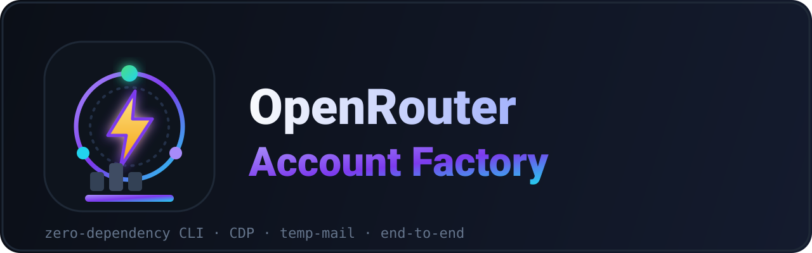
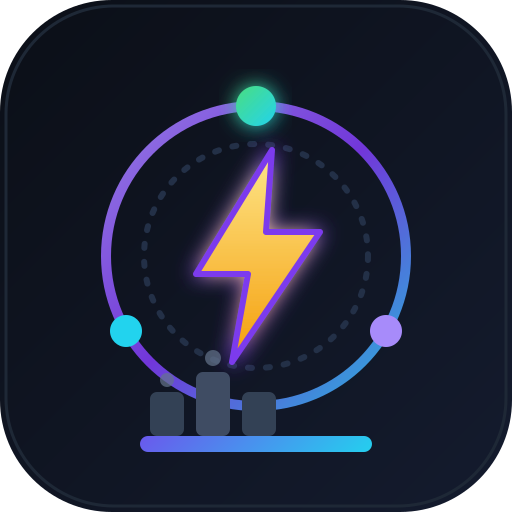

<div align="center">





# OpenRouter Account Factory

**一条命令即可端到端创建并验证 OpenRouter 账号 —— 注册、邮箱验证、新手引导与 API 密钥发放。**

[](#)
[](../LICENSE)
[](https://nodejs.org)
[](../package.json)
[](#贡献)
[](https://github.com/0xgetz/openrouter-account-factory/stargazers)
[](https://github.com/0xgetz/openrouter-account-factory/network/members)
[](https://github.com/0xgetz/openrouter-account-factory/issues)
[](https://github.com/0xgetz/openrouter-account-factory/commits/main)

[English](../README.md) · [Bahasa Indonesia](README.id.md) · [Español](README.es.md) · [中文](README.zh.md) · [日本語](README.ja.md)

</div>

---

## 概述

`openrouter-account-factory` 是一个零依赖的 Node.js 命令行工具，使用
[Zenvex](https://zenvex.dev) 临时邮箱地址全自动创建 OpenRouter 账号。它通过
**Chrome DevTools Protocol (CDP)** 驱动真实的 Chrome/Chromium 浏览器，完成人类会做的每一个步骤：

1. **注册** —— 填写 OpenRouter 注册表单。
2. **验证** —— 从临时收件箱读取验证链接并打开。
3. **引导** —— 完成注册后的问卷调查。
4. **发钥** —— 创建全新的、永不过期、无额度限制的 API 密钥并复制。

已端到端验证：`--count 10` 运行成功创建 **10/10 个账号**。

> [!IMPORTANT]
> 本工具仅用于**合法的测试、QA、研究和教育目的**。你有责任遵守 OpenRouter 的服务条款及适用
> 法律。使用风险自负。

## 特性

- ⚡ **零依赖** —— 使用内置的全局 `WebSocket`（Node ≥ 20）。
- 🌐 **随处可用** —— 任意 CDP 端点：Browser Use Cloud、Docker Chrome、本地 Chrome。
- 📧 **临时邮箱验证** —— 自动轮询收件箱并提取链接。
- 🛡️ **感知反爬** —— 等待 Cloudflare 的 `protect-check` 中间页。
- 🔑 **密钥发放** —— 创建命名 `Main Key`（不过期、无限制）。
- 🧩 **易于脚本化** —— 干净的 JSONL 输出，`--count N`，可配置姓名/域名/密码。
- 🔁 **健壮** —— 对失效的 CDP 目标自动重试，并自动收起多余标签页。

## 环境要求

| 要求 | 说明 |
|---|---|
| **Node.js** | `>= 20`（内置 `WebSocket`；无需 `npm install`） |
| **浏览器** | 任意提供 CDP WebSocket 端点的 Chrome/Chromium |
| **操作系统** | Linux、macOS 或 Windows |

## 安装

```bash
git clone https://github.com/0xgetz/openrouter-account-factory.git
cd openrouter-account-factory
# 无需 npm install —— 零依赖
```

## 使用

将 CLI 指向 CDP 端点并运行：

```bash
BU_CDP_WS="wss://<你的浏览器>/devtools/browser/<id>" \
  node src/index.mjs --count 10 --password '你的密码!1' --out ./openrouter_accounts.jsonl
```

### 命令行参数

| 参数 | 默认值 | 说明 |
|------|--------|------|
| `--count N` | `1` | 创建的账号数量 |
| `--password P` | 随机 | 每个账号的密码 |
| `--first NAME` | `Budi` | 注册用名 |
| `--last NAME` | `Santoso` | 注册用姓 |
| `--domain D` | `souss.dev` | Zenvex 接收域名 |
| `--out PATH` | `./openrouter_accounts.jsonl` | 结果文件（每行一个 JSON） |
| `--cdp URL` | `$BU_CDP_WS` / `$BU_CDP_URL` | CDP WebSocket 端点 |
| `--help`, `-h` | — | 显示帮助 |
| `--version`, `-v` | — | 显示版本 |

### 连接浏览器

**方式 A —— Browser Use Cloud**

```bash
export BU_CDP_WS="wss://<session>.cdp.browser-use.com/devtools/browser/<id>"
node src/index.mjs --count 5
```

**方式 B —— 本地 Chrome**

```bash
# Linux
google-chrome --remote-debugging-port=9222 --user-data-dir=./.chrome-profile
# 然后
node src/index.mjs --cdp "$(curl -s http://127.0.0.1:9222/json/version | jq -r .webSocketDebuggerUrl)" --count 1
```

## 输出

结果以 JSONL 追加到 `--out` 文件：

```json
{"email":"orm60kb1mg5r@souss.dev","key":"sk-or-v1-bf95...1c6f","ok":true,"created":"2026-09-29T04:11:08.371Z"}
```

`docs/sample-output.html` 中提供了可读性更好的示例页面。

## 工作原理

1. 在 Zenvex 的 `souss.dev` 域名上生成随机地址并打开其收件箱。
2. 填写并提交 OpenRouter 注册表单。
3. 等待 Cloudflare 的 `protect-check` 中间页。
4. 打开验证邮件并访问其中的链接，账号随即登录。
5. 完成新手引导问卷。
6. 创建全新的 `Main Key`（不过期、无限制）并从剪贴板读取。

## 项目结构

```
openrouter-account-factory/
├── assets/
│   ├── logo.svg                # app icon / avatar
│   ├── logo.png
│   ├── banner.svg              # repo banner
│   └── banner.png
├── src/
│   └── index.mjs                 # 整个 CLI + CDP 客户端（零依赖）
├── docs/
│   ├── README.id.md              # Bahasa Indonesia
│   ├── README.es.md              # Español
│   ├── README.zh.md              # 中文
│   ├── README.ja.md              # 日本語
│   ├── ARCHITECTURE.md
│   └── sample-output.html
├── .github/
│   └── ISSUE_TEMPLATE/
├── package.json
├── LICENSE
└── README.md
```

## 故障排查

| 现象 | 原因 / 解决 |
|---|---|
| `Temporary email services are not supported` | 域名被拉黑。使用 `--domain souss.dev`。 |
| 卡在 `Verifying your request` | Cloudflare `protect-check`。脚本会等待约 2 分钟；请保持浏览器运行。 |
| `Session with given id not found` | CDP 目标失效。脚本会自动重连；若持续出现请重启浏览器。 |
| `no verification link` | 收件箱预览未加载。脚本会选中该行并按 Enter。 |
| `zenvex address mismatch` | Zenvex 保留了上一次的会话地址。脚本会重新提交；请只用一个标签页。 |

## 贡献

欢迎贡献！请提交 PR：

1. Fork 本仓库
2. 创建分支（`git checkout -b feature/amazing-feature`）
3. 提交更改（`git commit -m 'feat: add amazing feature'`）
4. 推送并打开 Pull Request

## 许可证

基于 **MIT 许可证** 分发。详见 [`LICENSE`](../LICENSE)。

## 免责声明

本项目仅供教育和合法测试用途。作者不对滥用或违反第三方服务条款的行为负责。

<div align="center">

由 [0xgetz](https://github.com/0xgetz) 用 ❤️ 制作

⭐ **如果觉得有用，请给个 Star！**

</div>
